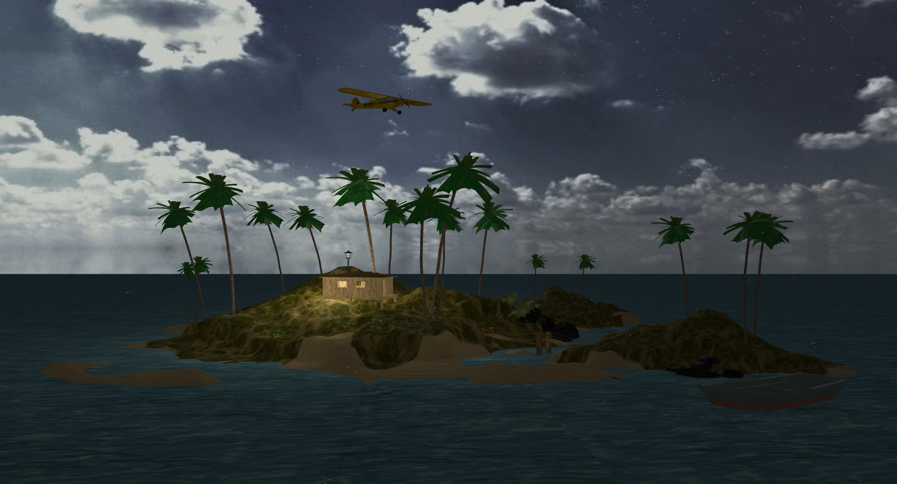
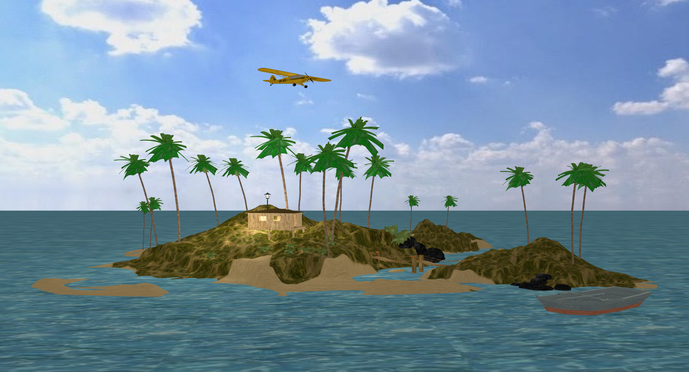
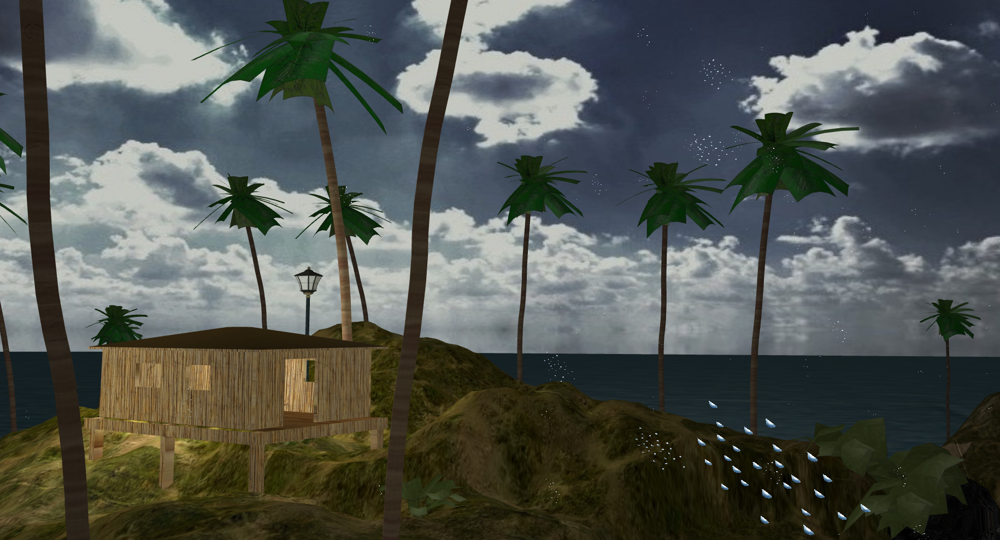
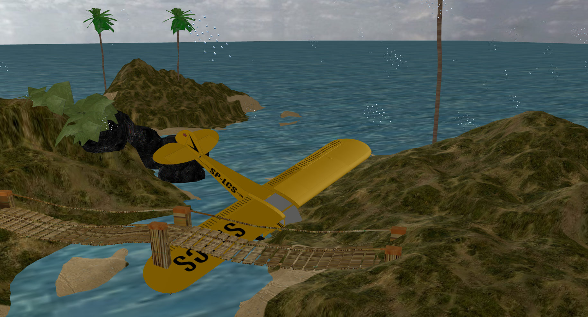
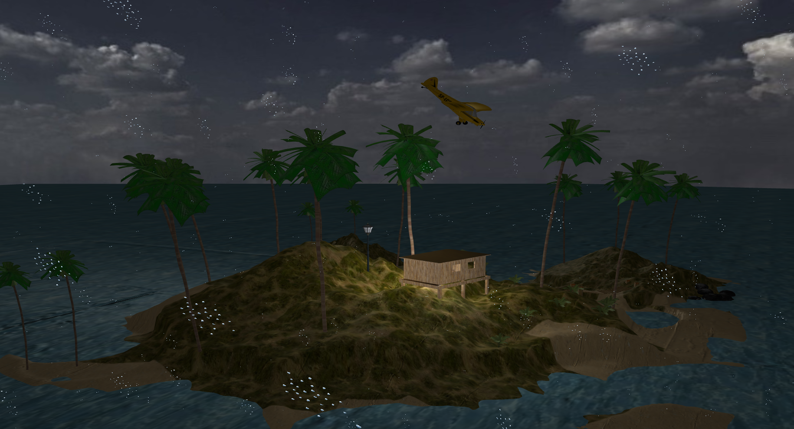
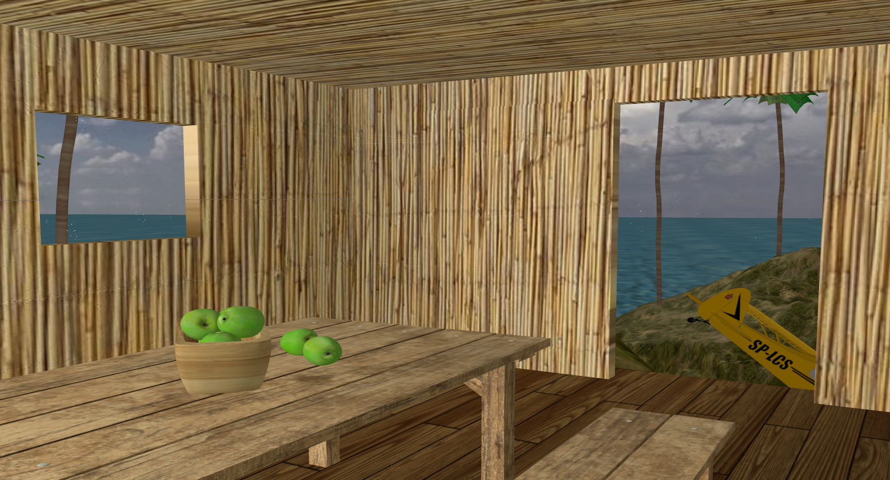
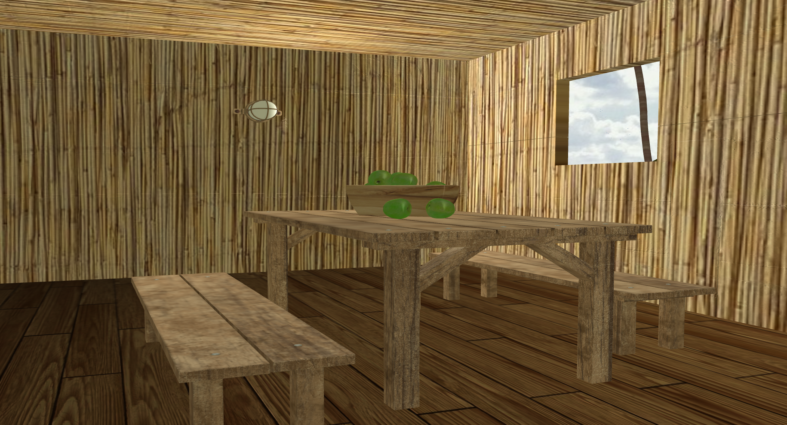

Projekat iz predmeta Računarska Grafika na Matematičkom fakultetu, Univerziteta u Beogradu.

---------------------
# Komande

`F1` - on/off imgui

`P`  - on/off pointLight

`Q`  - lower heightScale for parallax mapping

`E`  - increase heightScale for parallax mapping

`R`  - change weather (sun/rain/storm)

`C`  - plane crush

`W`  - move camera forward

`A`  - move camera left

`S`  - move camera back

`D`  - move camera right

`UP` - move camera up

`DOWN` - move camera down

 

---------------------

# Implementirano iz oblasti A:
* Cubemaps
* Anti Aliasing

# Implementirano iz oblasti B:
* Normal mapping
* Parallax mapping

 

# Uputstvo
1. `git clone https://github.com/AnjaJovanovic/rg-projekat.git`
2. Main se nalazi u src/main.cpp
3. Cpp fajlovi idu u src folder
4. Zaglavlja (h i hpp) fajlovi idu u include
5. Šejderi idu u folder shaders. `Vertex shader` ima ekstenziju `.vs`, `fragment shader` ima ekstenziju `.fs`

# Korišćeni modeli
- [Island](https://www.turbosquid.com/3d-models/free-island-3d-model/794972)
- [Airplane](https://www.turbosquid.com/3d-models/piper-pa-18-supercub-fbx-free/1041070)
- [Boat](https://www.turbosquid.com/3d-models/old-rowboat-675083)
- [Chairs and table](https://www.turbosquid.com/3d-models/wooden-table-3d-model-2104045)
- [Apples](https://www.turbosquid.com/3d-models/vase-apple-max-free/851747)
- [Street lamp](https://free3d.com/3d-model/street-lamp-40556.html)
- [Indoor lamp](https://www.turbosquid.com/3d-models/3d-light-1-model-2106876)
---------------

[Skelet projekta](https://github.com/matf-racunarska-grafika/project_base.git)

--------------------

# Galerija

